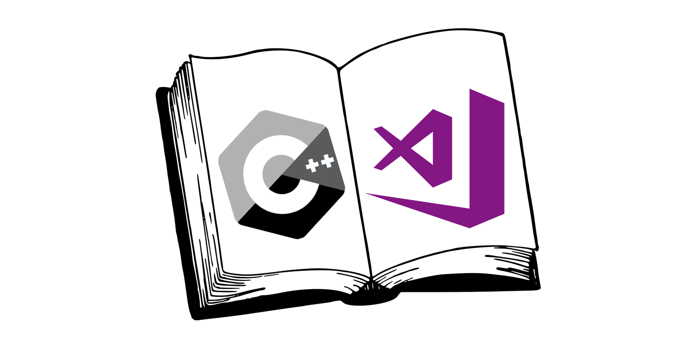

Završni projekat iz predmeta Napredne tehnike programiranja

Program nudi dva (2) korisnička režima: osoblje biblioteke i korisnici iste.

Ukoliko koristite ovaj program kao osoblje biblioteke imate mogućnost unosa knjiga, pregleda istih, unosa novih „pretplatnika“ biblioteke, također pregled istih. Sve unesene knjige se spremaju u jednu tekstualnu datoteku koja služi kao neki vid baze podataka, a također i članska karta učlanjene osobe se sprema opet u posebnu tekstualnu datoteku.

Pregled knjiga i učlanjenih osoba u biblioteku je moguć na više različitih načina. 
Ukoliko govorimo o knjigama onda je to način sortiranja po nazivu knjige, imenu autora, kao i prezimenu, izdavačkoj kući... 
A ako želite pregledati učlanjene možete ih pregledati sortirane po imenima, prezimenima, godinama, također posebno ispisane pripadnice ljepšeg spola, kao i pripadnici jačeg spola. 

Specifična pretraga knjige u sistemu se može izvršiti unosom naziva knjige, imena autora, prezimena, kao i izdavačke kuće. Ukoliko dođe do poklapanja ta knjiga se nalazi u sistemu i bude ispisana u konzoli.

Ukoliko se u korisničkom režimu „korisnik“ možete ostaviti feedback u vidu ocjene sistema, možete ostaviti kritiku/pohvalu za isti, te se možete potpisati ako to želite. 
Svaki feedback se sprema u posebnu tekstualnu datoteku i ostaje spremljen trajno.

Input-i su osigurani za većinu mogućih grešaka koje korisnik može napraviti, bar za one kojih smo se mi mogli sjetiti dok smo radili na ovom programu.

